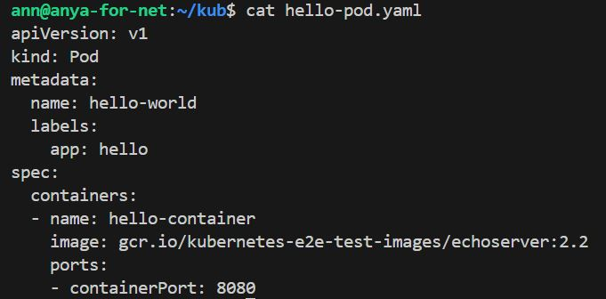
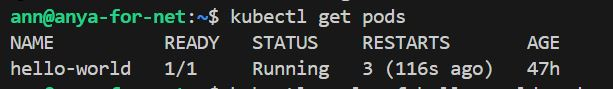
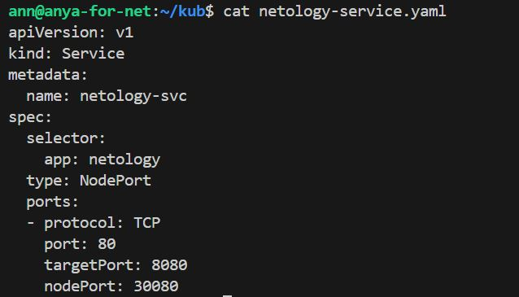
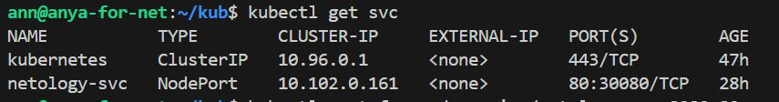

# Домашнее задание к занятию «Базовые объекты K8S»

## Задание 1. Создать Pod с именем hello-world

Создать манифест (yaml-конфигурацию) Pod.

Использовать image - gcr.io/kubernetes-e2e-test-images/echoserver:2.2.





Подключиться локально к Pod с помощью kubectl port-forward и вывести значение (curl или в браузере).

## Задание 2. Создать Service и подключить его к Pod

Создать Pod с именем netology-web.

Использовать image — gcr.io/kubernetes-e2e-test-images/echoserver:2.2.



Создать Service с именем netology-svc и подключить к netology-web.

Подключиться локально к Service с помощью kubectl port-forward и вывести значение (curl или в браузере).




В данном задании столкнулась с проблемой, что всё работает кроме curl. Логи нормальные. Все ок. Но курл не понятно почем не работает.
Проброс портов выполнила, все настроила.

Команды для проброса портов были 
```
kubectl port-forward pod/hello-world 8888:8080
kubectl port-forward svc/netology-svc 8080:80
```
