# Домашнее задание к занятию «Конфигурация приложений»

## Задание 1. Создать Deployment приложения и решить возникшую проблему с помощью ConfigMap. Добавить веб-страницу

Создать Deployment приложения, состоящего из контейнеров nginx и multitool.

Решить возникшую проблему с помощью ConfigMap.

Продемонстрировать, что pod стартовал и оба конейнера работают.

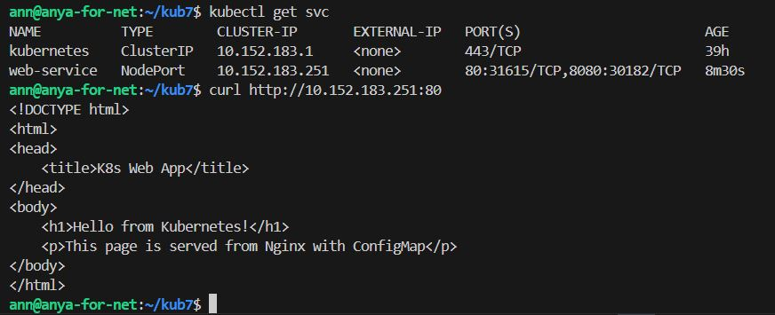

Сделать простую веб-страницу и подключить её к Nginx с помощью ConfigMap. Подключить Service и показать вывод curl или в браузере.

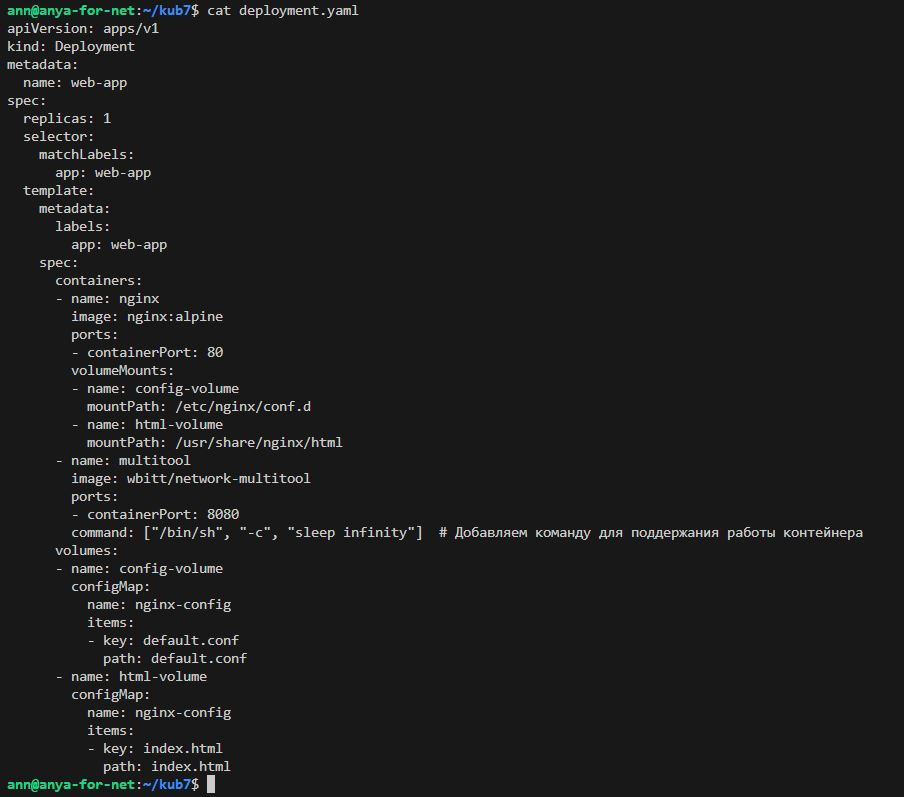

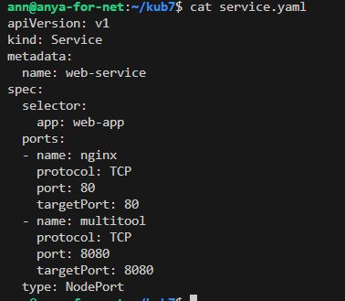

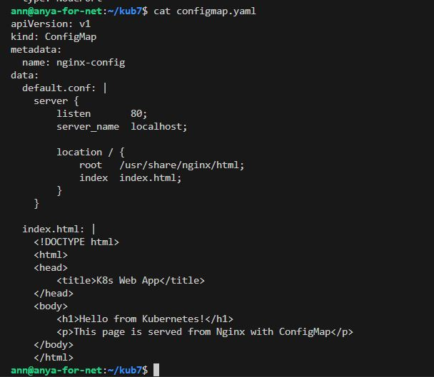

Предоставить манифесты, а также скриншоты или вывод необходимых команд.

## Задание 2. Создать приложение с вашей веб-страницей, доступной по HTTPS

Создать Deployment приложения, состоящего из Nginx.

Создать собственную веб-страницу и подключить её как ConfigMap к приложению.
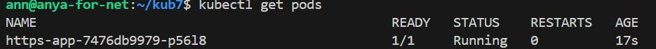

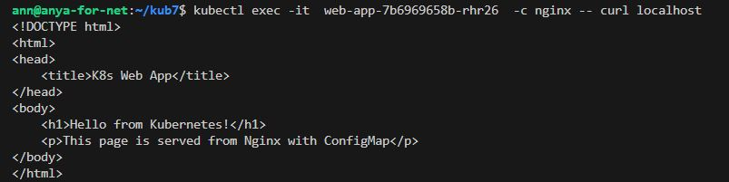

Выпустить самоподписной сертификат SSL. Создать Secret для использования сертификата.
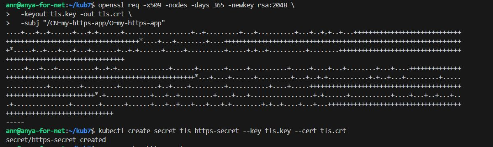

Создать Ingress и необходимый Service, подключить к нему SSL в вид. Продемонстировать доступ к приложению по HTTPS.

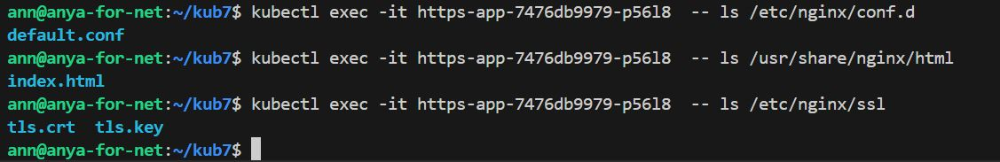

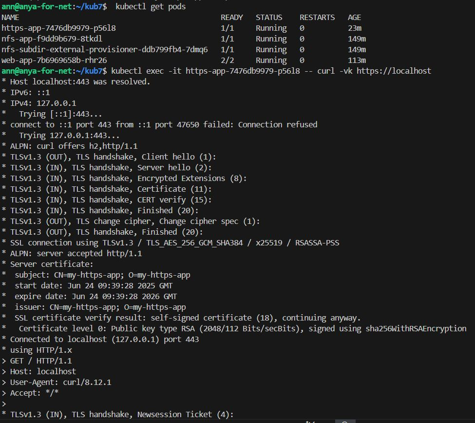
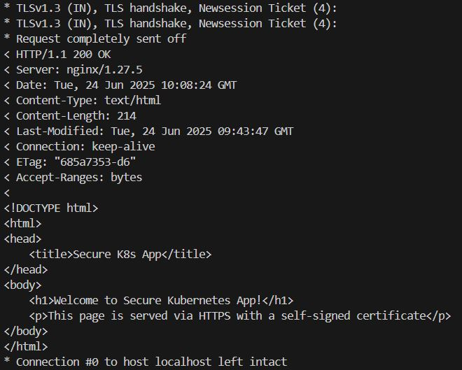

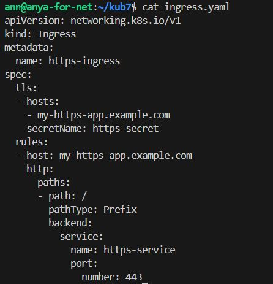

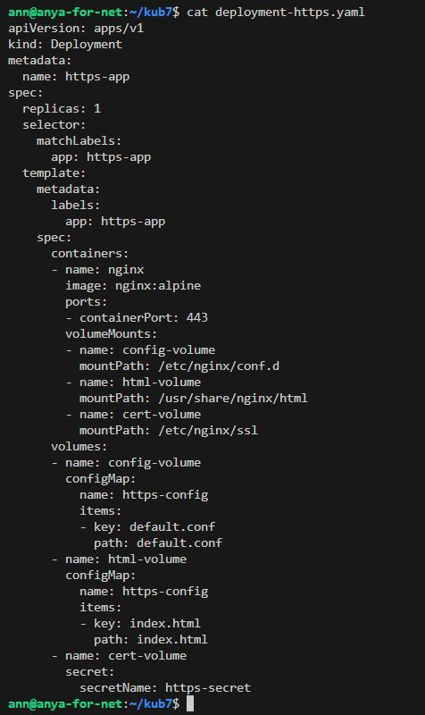

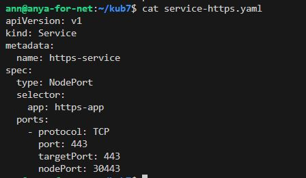

Предоставить манифесты, а также скриншоты или вывод необходимых команд.
