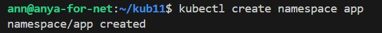
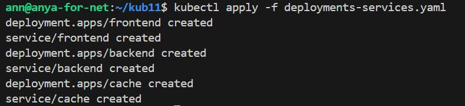
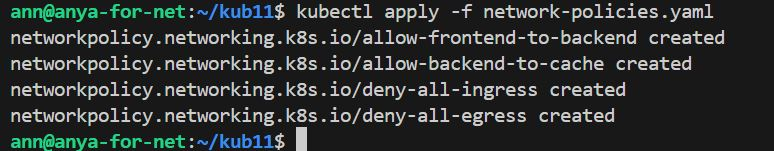
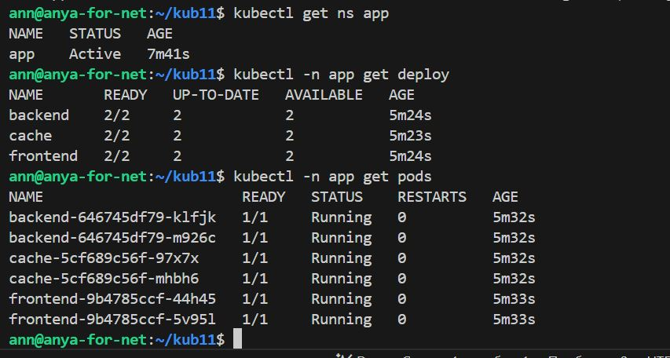
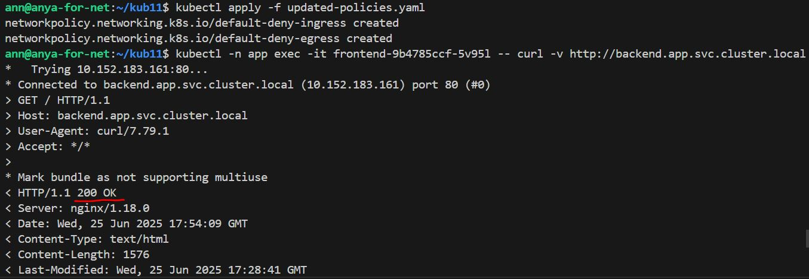
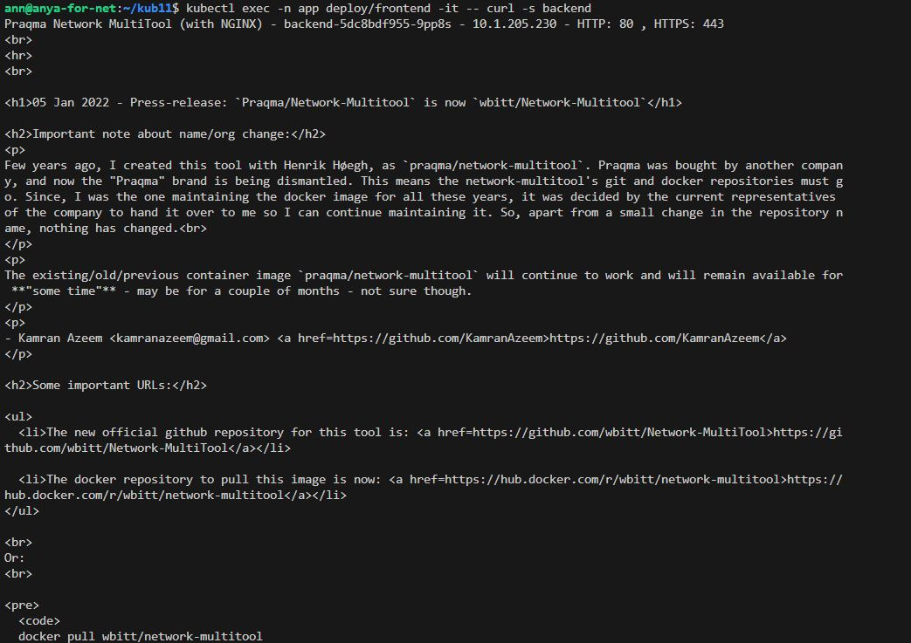
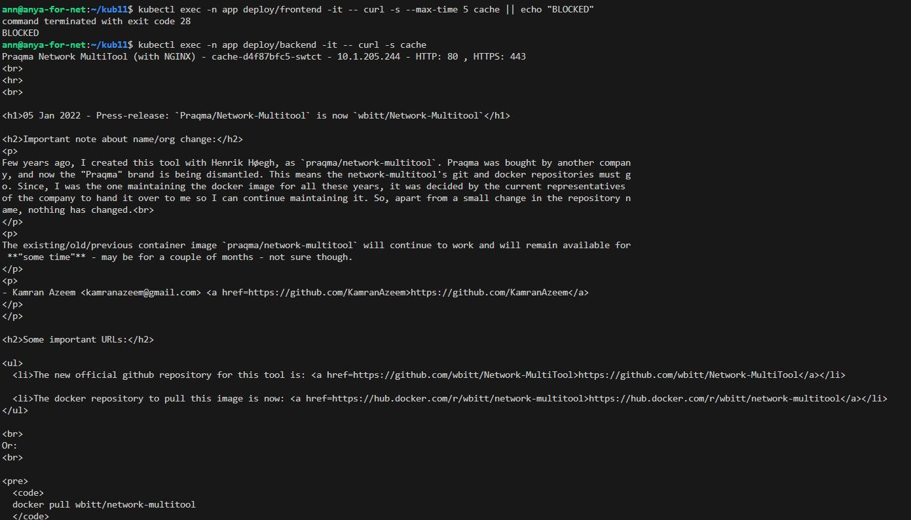
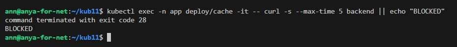

# Домашнее задание к занятию «Как работает сеть в K8s»

## Задание 1. Создать сетевую политику или несколько политик для обеспечения доступа

Создать deployment'ы приложений frontend, backend и cache и соответсвующие сервисы.

В качестве образа использовать network-multitool.

Разместить поды в namespace App.

Создать политики, чтобы обеспечить доступ frontend -> backend -> cache. Другие виды подключений должны быть запрещены.

Продемонстрировать, что трафик разрешён и запрещён.

