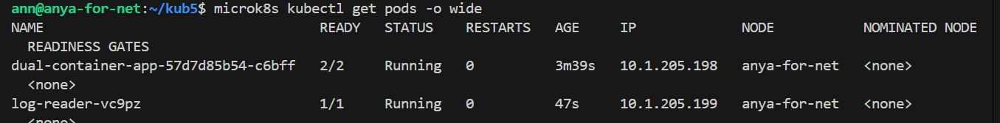

# Домашнее задание к занятию «Хранение в K8s. Часть 1»

## Задание 1

Создать Deployment приложения, состоящего из двух контейнеров и обменивающихся данными.

Создать Deployment приложения, состоящего из контейнеров busybox и multitool.

Сделать так, чтобы busybox писал каждые пять секунд в некий файл в общей директории.

Обеспечить возможность чтения файла контейнером multitool.

Продемонстрировать, что multitool может читать файл, который периодоически обновляется.

Предоставить манифесты Deployment в решении, а также скриншоты или вывод команды из п. 4.

## Задание 2

Создать DaemonSet приложения, которое может прочитать логи ноды.

Создать DaemonSet приложения, состоящего из multitool.

Обеспечить возможность чтения файла /var/log/syslog кластера MicroK8S.

Продемонстрировать возможность чтения файла изнутри пода.

Предоставить манифесты Deployment, а также скриншоты или вывод команды из п. 2.

Для инфо.

