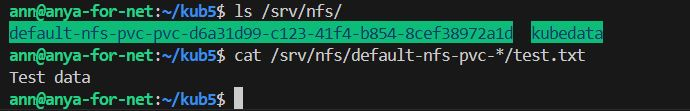

# Домашнее задание к занятию «Хранение в K8s. Часть 2»

## Задание 1
Что нужно сделать

Создать Deployment приложения, использующего локальный PV, созданный вручную.

Создать Deployment приложения, состоящего из контейнеров busybox и multitool.

Создать PV и PVC для подключения папки на локальной ноде, которая будет использована в поде.

Продемонстрировать, что multitool может читать файл, в который busybox пишет каждые пять секунд в общей директории.

Удалить Deployment и PVC. Продемонстрировать, что после этого произошло с PV. Пояснить, почему.

PV всё ещё существует, но PVC, к которому он был привязан — удалён.
Поскольку persistentVolumeReclaimPolicy: Retain, Kubernetes не удаляет данные, а PV остаётся "освобождённым" (Released).

Продемонстрировать, что файл сохранился на локальном диске ноды. Удалить PV. Продемонстрировать что произошло с файлом после удаления PV. Пояснить, почему.

Потому что Kubernetes не управляет содержимым локальной директории, а просто монтирует её. Удаление PVC не трогает физический диск, если политика — Retain.

Предоставить манифесты, а также скриншоты или вывод необходимых команд.

Для инфо.

## Задание 2
Что нужно сделать

Создать Deployment приложения, которое может хранить файлы на NFS с динамическим созданием PV.

Включить и настроить NFS-сервер на MicroK8S.

Создать Deployment приложения состоящего из multitool, и подключить к нему PV, созданный автоматически на сервере NFS.

Продемонстрировать возможность чтения и записи файла изнутри пода.

Предоставить манифесты, а также скриншоты или вывод необходимых команд.

Для инфо.

