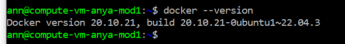

# Дз по занятию «Введение в виртуализацию»

## Задние 1
Здесь необходимо было создать вм через web-интерфейс Yandex Cloud с указанными критериями.
Создала и подключилась к вм. Так же проверила что на вм есть Docker.

И как видно из скрина, на вм уже установлен Docker версии 20.10.21

## Задние 2
Нужно в зависимости от задачи выбрать наиболее подходящую платформу.

Задача 1. Есть высоконагруженная база данных MySql, критичная к отказу.\
   Здесь подойдет несколько вариантов. А именно использование паравиртуализации или физических серверов.
  - Так как для критичных к отказу приложений важно минимизировать время простоя. Физические серверы могут обеспечить высокую надежность при правильной конфигурации и резервировании.
  - Паравиртуализация может быть полезной для разделения нагрузки между несколькими виртуальными машинами, но важно следить за тем, чтобы ресурсы были выделены адекватно.
  - Физические сервера могут быть более безопасными, так как они не подвержены рискам, связанным с виртуализацией.
    
Задача 2. Различные web-приложения;\
   Здесь я склоняюсь больше виртуализации уровня ОС (например, Docker), или в крайнем случае паравиртуализации.
  - Виртуализация уровня ОС позволяет легко разворачивать и масштабировать приложения. Это особенно полезно для web-приложений, которые могут требовать разных версий окружения.
  - Контейнеризация упрощает процесс развертывания и управления зависимостями.
  - Виртуализация уровня ОС обеспечивает хорошую изоляцию между приложениями, что уменьшает риски конфликтов между ними.
    
Задача 3. Windows-системы для использования бухгалтерским отделом;\
   Здесь подойдет паравиртуализация или физические сервера.
  - Виртуализация может обеспечить достаточную производительность для офисных приложений, но в некоторых случаях может потребоваться выделенный сервер для обеспечения стабильной работы.
   
Задача 4. Системы, выполняющие высокопроизводительные расчёты на GPU.
   Здесь я бы остановилась только на физических серверах. Так как не все решения по виртуализации поддерживают полное использование GPU, поэтому физические серверы являются приемлемым вариантом. 
   

   
## Задние 3
Сценарии:

 1. 100 виртуальных машин на базе Linux и Windows, общие задачи, нет особых требований. Преимущественно Windows based-инфраструктура, требуется реализация программных балансировщиков нагрузки, репликации данных и автоматизированного механизма создания резервных копий.
    
Здесь я бы выбрала Proxmox Virtual Environment. Так как есть преимущества:
- Возможность реализации программных балансировщиков нагрузки с использованием дополнительных инструментов (например, HAProxy).
- Поддержка как Windows, так и Linux виртуальных машин.

2. Требуется наиболее производительное бесплатное open source-решение для виртуализации небольшой (20-30 серверов) инфраструктуры на базе Linux и Windows виртуальных машин.

   Здесь я бы выбрала KVM. Так как есть преимущества:
  - Высокая производительность благодаря интеграции с ядром Linux.
  - Поддержка множества дистрибутивов Linux и Windows.
  - Возможность настройки через командную строку.   

3. Необходимо бесплатное, максимально совместимое и производительное решение для виртуализации Windows-инфраструктуры.

   Здесь я бы выбрала Microsoft Hyper-V. Так как есть преимущества:
  - Отличная совместимость с Windows-системами.
  - Высокая производительность для Windows-виртуальных машин.
  - Поддержка функций резервного копирования и репликации данных через встроенные инструменты.

4. Необходимо рабочее окружение для тестирования программного продукта на нескольких дистрибутивах Linux.

Здесь я бы выбрала VirtualBox. Так как есть преимущества:
- Легкость в установке и использовании.
- Поддержка множества дистрибутивов Linux.
- Возможность создания снимков виртуальных машин для тестирования.
- Кросс-платформенность: работает на Windows, macOS и Linux.

## Задние 4
Описать возможные проблемы и недостатки гетерогенной среды виртуализации. Если бы у меня был выбор, создала бы я гетерогенную среду или нет?

Одна из самых очевидных проблем это сложность управления. Так как наличие нескольких систем управления усложняет администрирование, соответственно требует знаний/опыта администрирования такой системой. Тут можно обучить сотрудников работать с данной системой, большим плюсом будет интеграция инструментов управления. Также большим плюсом будет введение мониторинга, который поможет упростить отслеживание состояний систем, критических ошибок и различных сбоев.
Стоит отметить еще одну проблему, такую как совместимость разных систем. Разные системы могут иметь проблемы совместимости между собой и могут иметь различные уровни безопасности и обновления, что увеличивает риск уязвимостей и трудностей в интеграции и взаимодействии. Опять же многие проблемы могут решить квалифицированные сотрудники и качественно настроенный мониторинг.

Если бы я выбирала среду виртуализации, я бы предпочла однородную. Это бы упростило управление системой, повысило бы безопасность и снизило затраты на обучение и поддержку. (если это маленький бизнес/проект). Но в масштабах 
больших компаний имеет смысл использование геторогенной среды
   
