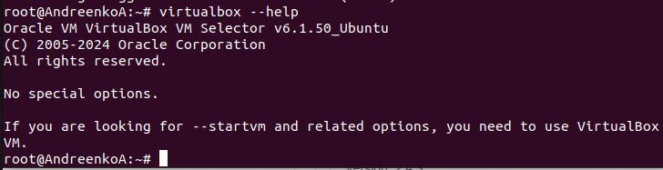
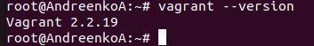
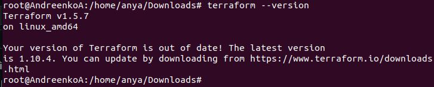
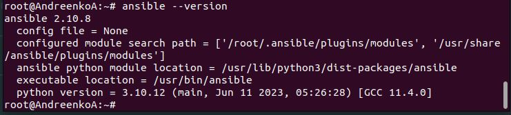
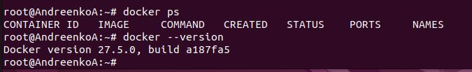

# Домашнее задание к занятию 2. «Применение принципов IaaC в работе с виртуальными машинами»

## Задание 1
#### Опишите основные преимущества применения на практике IaaC-паттернов.

IaaC/IaC - это управление и описание инфраструктуры через конфигурационные файлы, благодаря которому можно автоматизировать процессы развертывания и управления ресурсами. То есть это возможность создать конфиг файл и наложить/залить/развернуть его на нужных ресурсах, для повтора без ошибок. Это исключает ручной труди упращает автоматизацию.

Рассматрим более подробно основные преимущества:

1. Автоматизация и ускорение развертывания

IaC позволяет автоматизировать процессы развертывания инфраструктуры, что значительно ускоряет создание и настройку серверов, сетей и других ресурсов. Вместо ручного выполнения каждого шага, разработчики могут просто запустить скрипт или использовать инструмент, который автоматически выполнит все необходимые действия. Например, с помощью Terraform или AWS  можно описать всю инфраструктуру в виде кода, а затем развернуть ее за считанные минуты.

2. Повышение повторяемости и предсказуемости

Использование IaC гарантирует, что одна и та же конфигурация будет развернута одинаково каждый раз. Это особенно важно в больших командах или при работе с несколькими средами (разработка, тестирование, продакшн).

3. Улучшение контроля версий

Инфраструктура как код может храниться в системах контроля версий, таких как Git. Это позволяет отслеживать изменения в конфигурации, видеть историю изменений и легко откатываться к предыдущим версиям в случае необходимости. Например, если новая конфигурация вызывает проблемы, можно быстро вернуться к рабочей версии.

4. Упрощение управления конфигурацией

IaC позволяет централизованно управлять конфигурацией всех ресурсов. Это означает, что изменения можно вносить в одном месте и автоматически применять ко всем связанным ресурсам. Инструмент Ansible позволяет управлять конфигурацией серверов, устанавливать программное обеспечение и поддерживать его в актуальном состоянии.

5. Снижение затрат на обслуживание

Автоматизация процессов управления инфраструктурой снижает необходимость в ручном администрировании, что уменьшает затраты на рабочую силу и минимизирует человеческие ошибки. 

6. Повышение гибкости и масштабируемости

IaC позволяет легко изменять инфраструктуру в ответ на изменяющиеся требования бизнеса. Например, если приложение требует больше вычислительных ресурсов, вы можете изменить параметры конфигурации и быстро масштабировать инфраструктуру без необходимости ручного вмешательства.

7. Тестирование и проверка изменений

С помощью IaC можно создавать тестовые среды для проверки изменений перед их применением в продакшн. Это дает возможность протестировать новые конфигурации и обновления без риска для основной системы. Например, можно создать тестовую версию приложения с новой инфраструктурой и проверить ее работоспособность перед развертыванием.

#### Какой из принципов IaaC является основополагающим?

Основополагающим принципом Infrastructure as Code (IaC) является **повторяемость**. Этот принцип подразумевает, что инфраструктура может быть создана, изменена и удалена с использованием кода, который описывает её состояние. Благодаря этому, одна и та же конфигурация может быть развернута в разных средах (например, разработка, тестирование, продакшн) с одинаковыми результатами.

Повторяемость обеспечивает:

1. Предсказуемость: Зная, что код будет работать одинаково в разных средах, команды могут избежать неожиданных проблем и ошибок.

2. Упрощение управления версиями: Код можно хранить в системах контроля версий, что позволяет отслеживать изменения и откатываться к предыдущим версиям при необходимости.

3. Снижение риска ошибок: Автоматизация процессов развертывания уменьшает вероятность человеческих ошибок, связанных с ручной настройкой инфраструктуры.

## Задание 2
#### Чем Ansible выгодно отличается от других систем управление конфигурациями?

Ansible имеет несколько ключевых отличий от других систем управления конфигурациями, таких как Puppet, Chef или SaltStack:

1. Agentless (безагентный): Ansible не требует установки агентов на управляемых узлах. Вместо этого он использует SSH для подключения к удаленным системам, что упрощает развертывание и управление.

2. Простота использования: Ansible использует YAML для написания плейбуков, что делает его более доступным для понимания и написания.

3. Модульность: Ansible предлагает множество модулей для управления различными аспектами инфраструктуры, такими как облачные провайдеры, сетевые устройства и т.д. Это позволяет легко расширять функциональность.

4. Идемпотентность: Ansible обеспечивает идемпотентность, что означает, что повторное выполнение плейбука не приведет к изменению состояния системы, если она уже находится в нужном состоянии.

#### Какой, на ваш взгляд, метод работы систем конфигурации более надёжный — push или pull?

Методы работы систем конфигурации — push и pull:

• Push-метод: В этом методе управляющая система (Ansible) инициирует изменения на целевых узлах. Это может быть быстрее в некоторых сценариях, поскольку администраторы могут немедленно применять изменения по мере необходимости. Однако это может привести к проблемам с масштабируемостью и управлением, особенно в больших инфраструктурах.

• Pull-метод: В этом методе целевые узлы самостоятельно запрашивают обновления конфигурации у управляющей системы. Это может быть более надежным в больших и распределенных средах, так как узлы могут самостоятельно проверять и применять изменения в удобное для них время. Однако это может привести к задержкам в применении изменений.

Выбор метода зависит от конкретных требований и архитектуры вашей инфраструктуры. Если нужно быстрое развертывание изменений и вы работаете с небольшим количеством узлов, push-метод может быть предпочтительным. Если же инфраструктура большая и распределенная, pull-метод может обеспечить более надежное управление конфигурацией.

## Задание 3

Создала вм в VirtualBox с iso образом ubuntu 20.04. Настроила сеть в настройках (на сетевой мост). Также настроила git

Установила VirtualBox  

Установила Vagrant

Установила Terraform версии 1.5.7

Установила Ansible

## Задание 4

Продолжила работать в той вм, которую создала в задании 3. Docker установлен.

