# Домашнее задание к занятию 4. «Оркестрация группой Docker контейнеров на примере Docker Compose» 

<!--«Введение. Экосистема. Архитектура. Жизненный цикл Docker-контейнера» где это? -->

## Задание 1

https://hub.docker.com/r/anyaandreenko/custom-nginx/tags 

## Задание 2
Запуск контейнера andreenko-anya-custom-nginx-t2. Далее поменяла имя.

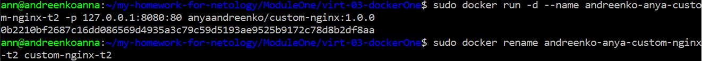

Проверка работы индекс стр. по curl

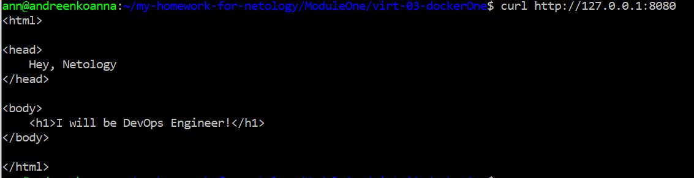 

## Задание 3

Чтобы подключиться к стандартному потоку ввода/вывода/ошибок контейнера "custom-nginx-t2" использовать следующую команду:

`sudo docker attach custom-nginx-t2`

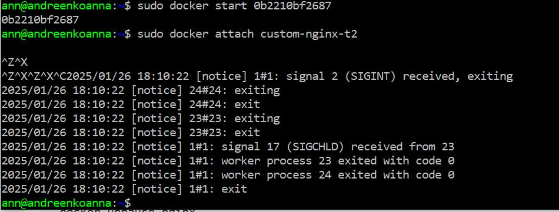

У меня получается что контейнер работает, но после этой команды все зависает и выдает следующее:

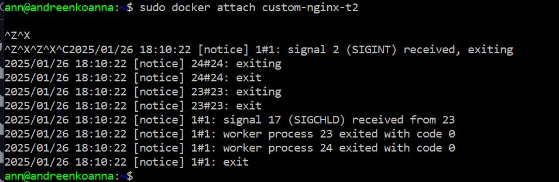

(останавливается из-за моей команды Ctrl-C, я так думаю)

Далее перезагрузка и запуск контейнера

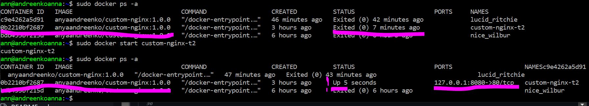

Внутри контейнера установка редактора nano

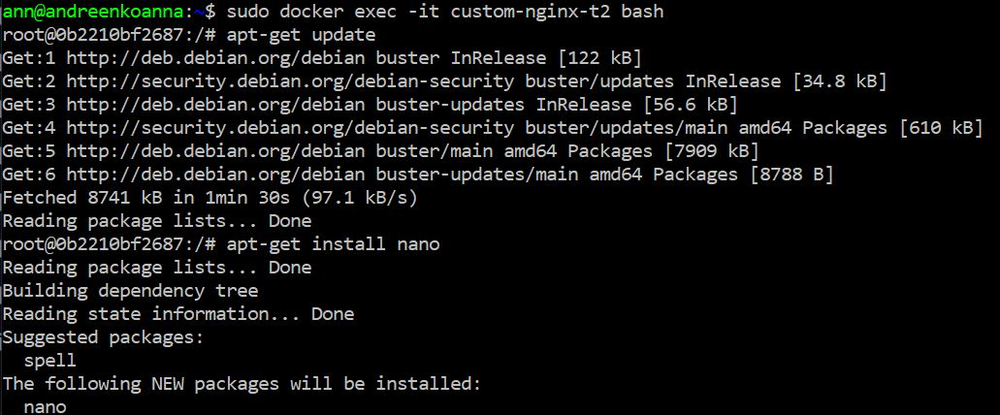

После редактирования файла "/etc/nginx/conf.d/default.conf" и замены номера порта, по которому теперь будет видна наша стр. с данными. Видим изменения.

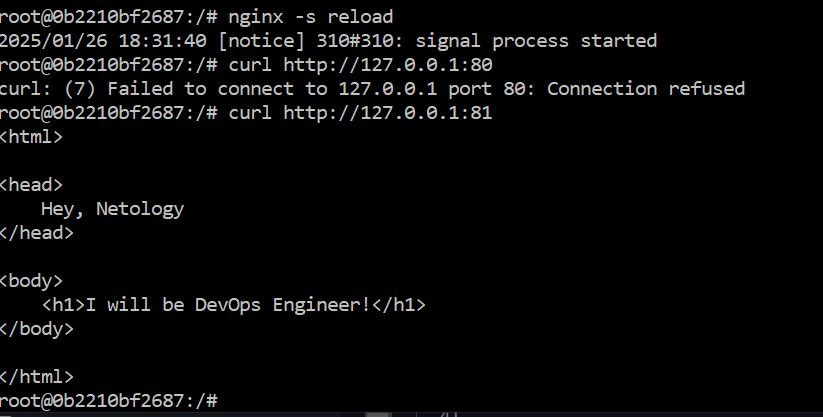

Выполнив следующие команды:

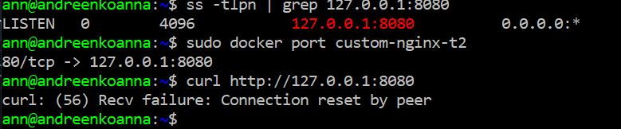

Ошибка  может быть связана с тем, что Nginx слушает на порту 81, а не на порту 8080. Поэтому при обращении к порту 8080 мы получаем ошибку.

Удаление контейнера без остановки:

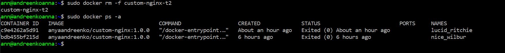

## Задание 4

Запустить первый контейнер из образа centos c любым тегом в фоновом режиме, подключив папку текущий рабочий каталог $(pwd) на хостовой машине в /data контейнера, используя ключ -v.

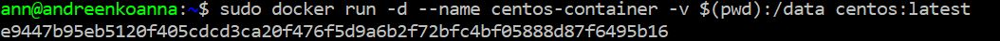

Запустить второй контейнер из образа debian в фоновом режиме, подключив текущий рабочий каталог $(pwd) в /data контейнера.

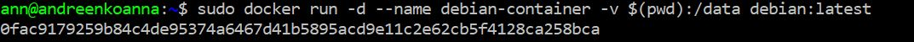

Создала файл в первом контейнере, а также создала файл на хостовом сервере. Зашла во второй контейнер и увидела все новые файлы. 

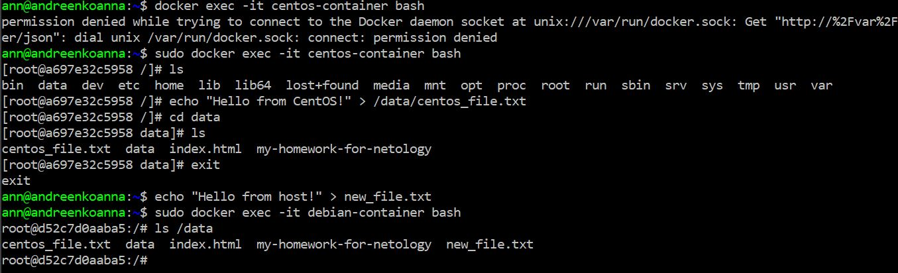

Это связано с тем, что то несколько контейнеров могут иметь доступ к одной и той же директории на хосте.
Если два контейнера используют /path/on/host, они будут видеть одни и те же файлы в /data.

## Задание 5
