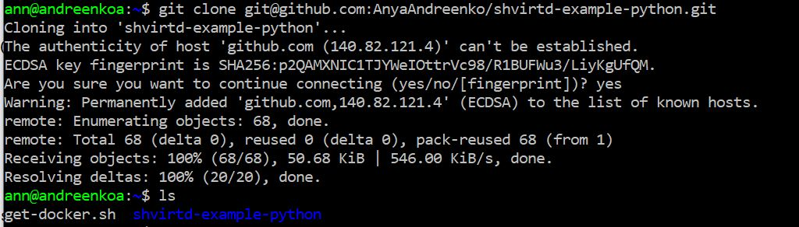
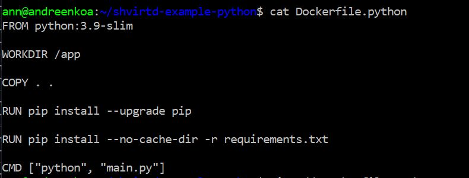
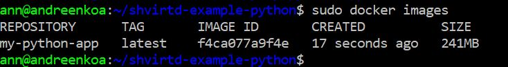
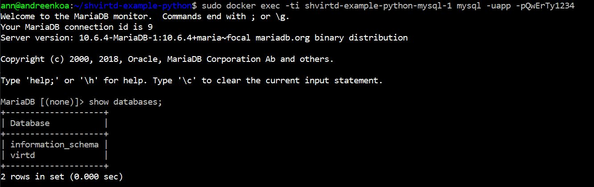
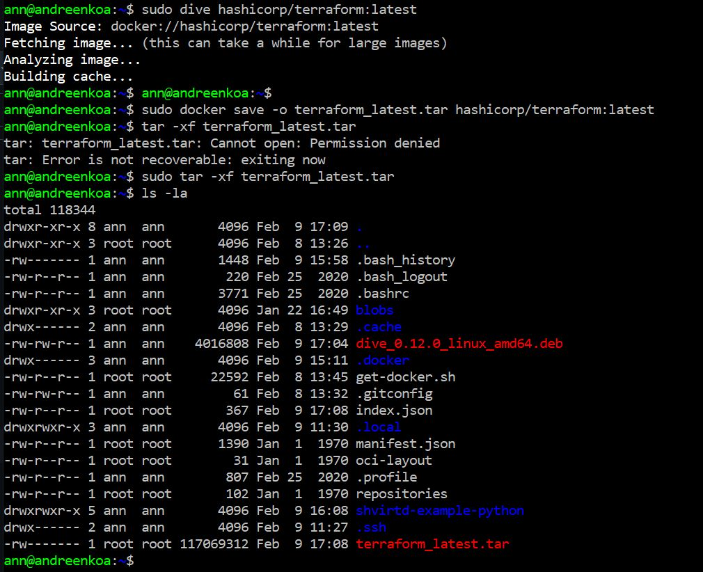
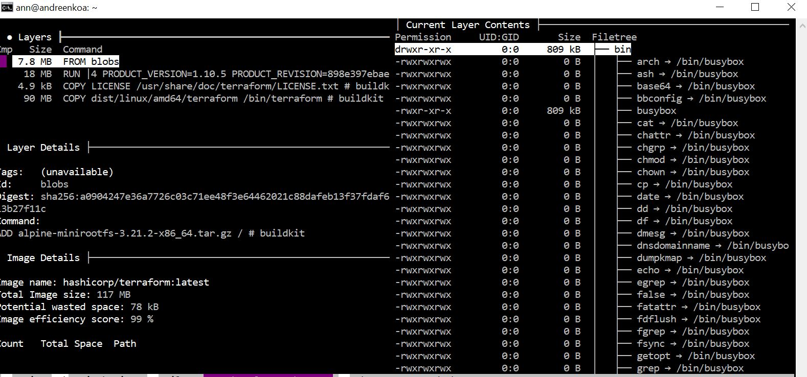

# Домашнее задание к занятию 5. «Практическое применение Docker»

## Задача 0
Убедилась что НЕ(!) установлен флажок docker-compose на созданной вм

## Задача 1

Добавила в свой репозиторий вилку GitHub пространство shvirtd-example-python

Создала Dockerfile.python, также исключила ненужные файлы с помощью dockerignore

Запустила чтоб проверить работу сформирования образа. Все ок 

[Ссылка на мой гитхаб](https://github.com/AnyaAndreenko/shvirtd-example-python/tree/main)

## Задача 3

Создала в репозитории с проектом файл compose.yaml.  С помощью директивы "include" подключила к нему файл "proxy.yaml"
также собрала проект и подключилась к базе.

## Задача 6

Скачала docker образ hashicorp/terraform:latest и скопируйте бинарный файл /bin/terraform на свою локальную машину, используя dive и docker save.

