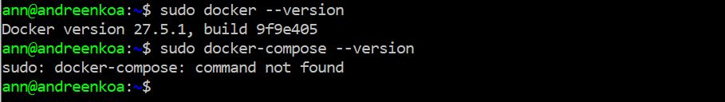

# Домашнее задание к занятию 5. «Практическое применение Docker»

## Задача 0
Убедилась что НЕ(!) установлен флажок docker-compose на созданной вм

## Задача 1

Добавила в свой репозиторий вилку GitHub пространство shvirtd-example-python

