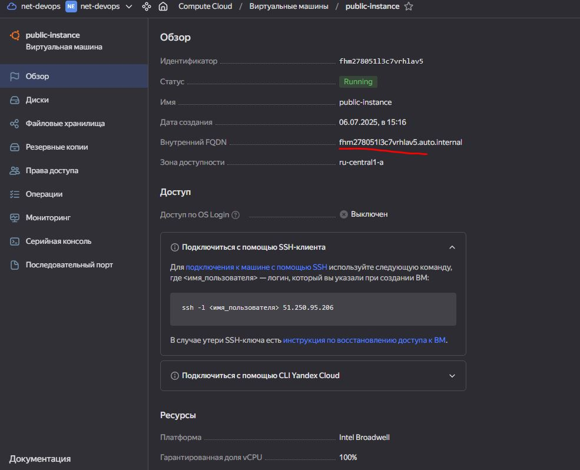

# Домашнее задание к занятию «Организация сети»

## Задание 1. Yandex Cloud

Создать  VPC. Выбрать зону.

Публичная подсеть.

Создать в VPC subnet с названием public, сетью 192.168.10.0/24.

Создать в этой подсети NAT-инстанс, присвоив ему адрес 192.168.10.254. В качестве image_id использовать fd80mrhj8fl2oe87o4e1.

Создать в этой публичной подсети виртуалку с публичным IP, подключиться к ней и убедиться, что есть доступ к интернету.

Приватная подсеть.

Создать в VPC subnet с названием private, сетью 192.168.20.0/24.

Создать route table. Добавить статический маршрут, направляющий весь исходящий трафик private сети в NAT-инстанс.

Создать в этой приватной подсети виртуалку с внутренним IP, подключиться к ней через виртуалку, созданную ранее, и убедиться, что есть доступ к интернету.

[main.tf](https://github.com/AnyaAndreenko/Networking/blob/main/one-net/src/main.tf)

[variables.tf](https://github.com/AnyaAndreenko/Networking/blob/main/one-net/src/variables.tf)
