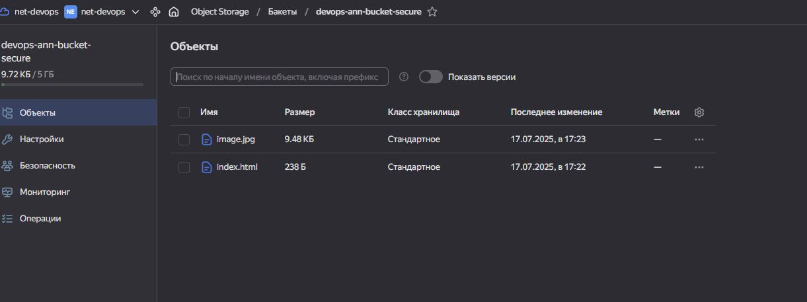
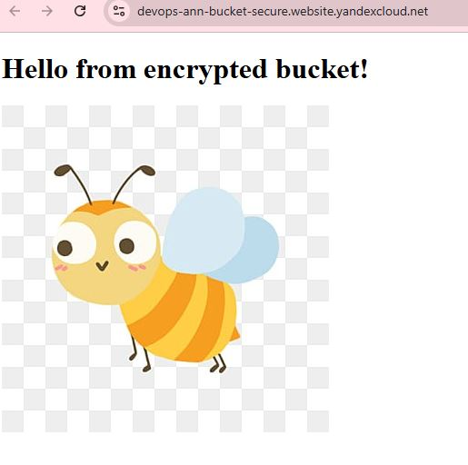
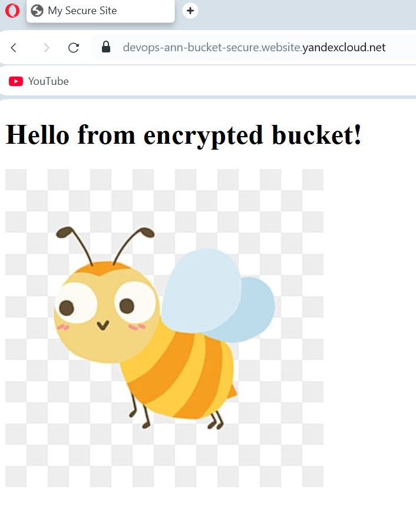

# Домашнее задание к занятию «Безопасность в облачных провайдерах»

С помощью ключа в KMS необходимо зашифровать содержимое бакета:
создать ключ в KMS;

с помощью ключа зашифровать содержимое бакета, созданного ранее.

[main.tf](https://github.com/AnyaAndreenko/Networking/blob/main/three-net/src/main.tf)

[index.html](https://github.com/AnyaAndreenko/Networking/blob/main/three-net/src/index.html)

(Выполняется не в Terraform)* Создать статический сайт в Object Storage c собственным публичным адресом и сделать доступным по HTTPS:
создать сертификат;

создать статическую страницу в Object Storage и применить сертификат HTTPS;

в качестве результата предоставить скриншот на страницу с сертификатом в заголовке (замочек).

