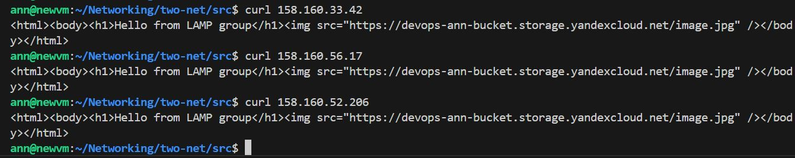

# Домашнее задание к занятию «Вычислительные мощности. Балансировщики нагрузки»

## Задание 1. Yandex Cloud

Что нужно сделать

Создать бакет Object Storage и разместить в нём файл с картинкой:

Создать бакет в Object Storage с произвольным именем.

Положить в бакет файл с картинкой.

Сделать файл доступным из интернета.

Создать группу ВМ в public подсети фиксированного размера с шаблоном LAMP и веб-страницей, содержащей ссылку на картинку из бакета:

Создать Instance Group с тремя ВМ и шаблоном LAMP. Для LAMP рекомендуется использовать image_id = fd827b91d99psvq5fjit.

[main](https://github.com/AnyaAndreenko/Networking/blob/main/two-net/src/main.tf)

Для создания стартовой веб-страницы рекомендуется использовать раздел user_data в meta_data.

Разместить в стартовой веб-странице шаблонной ВМ ссылку на картинку из бакета.

Подключить группу к сетевому балансировщику:

Создать сетевой балансировщик.

Проверить работоспособность, удалив одну или несколько ВМ.

Проверила, работает

