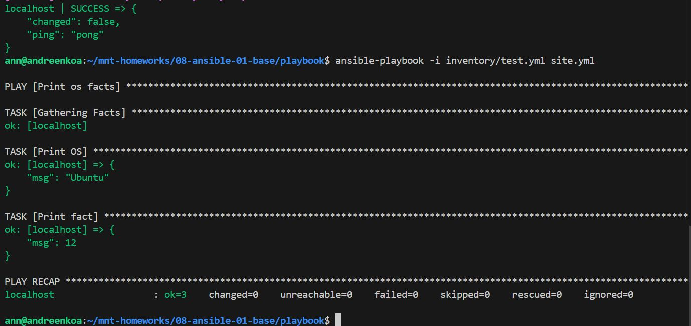
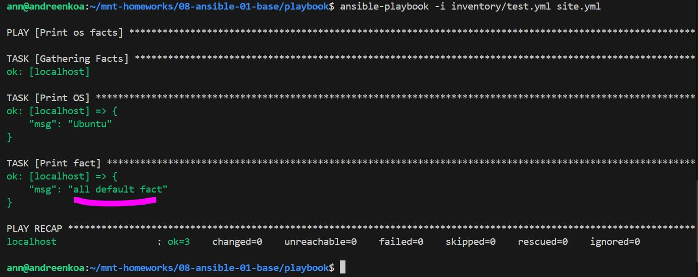
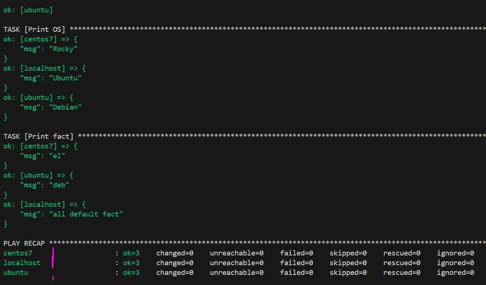
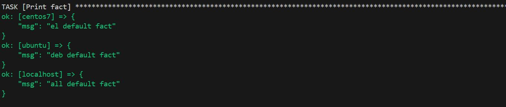
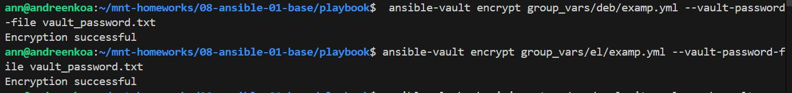
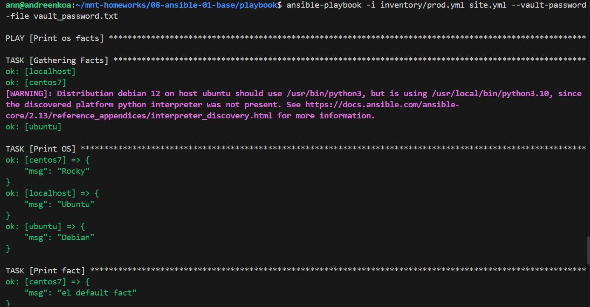
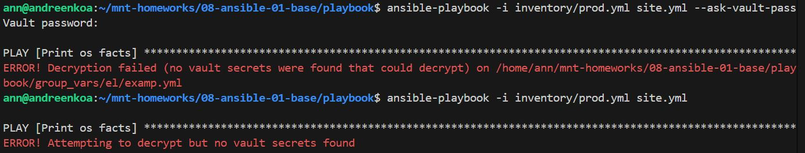

# Домашнее задание к занятию 1 «Введение в Ansible»

1. Попробуйте запустить playbook на окружении из test.yml, зафиксируйте значение, которое имеет факт some_fact для указанного хоста при выполнении playbook.

  
2. Найдите файл с переменными (group_vars), в котором задаётся найденное в первом пункте значение, и поменяйте его на all default fact.
  

3. Воспользуйтесь подготовленным (используется docker) или создайте собственное окружение для проведения дальнейших испытаний.

Взяла образы: (centos7 и ubuntu)

4. Проведите запуск playbook на окружении из prod.yml. Зафиксируйте полученные значения some_fact для каждого из managed host.
+ сразу добавила localhost из 10 задания

 
5. Проведите запуск playbook на окружении из prod.yml. Зафиксируйте полученные значения some_fact для каждого из managed host.
Добавьте факты в group_vars каждой из групп хостов так, чтобы для some_fact получились значения: для deb — deb default fact, для el — el default fact.

   

  
9.  Повторите запуск playbook на окружении prod.yml. Убедитесь, что выдаются корректные значения для всех хостов.
 При помощи ansible-vault зашифруйте факты в group_vars/deb и group_vars/el с паролем netology. Запустите playbook на окружении prod.yml. При запуске ansible должен запросить у вас пароль. Убедитесь в работоспособности.

 
 Зашифровала с помощью отдельного файла vault_password.txt в нем написано ( echo "netology" > vault_password.txt)
 при этом если этим файлом расшифрововать, то всё норм
 
 А без него никак

Пробовала разные способы, зашифровывает ок, а при расшифровке беда

Ссылка на репозиторий [ansible](https://github.com/AnyaAndreenko/mnt-homeworks)
