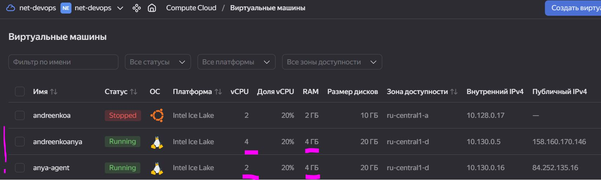
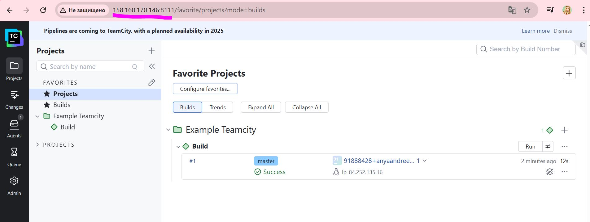
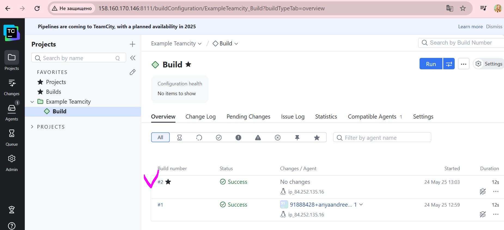
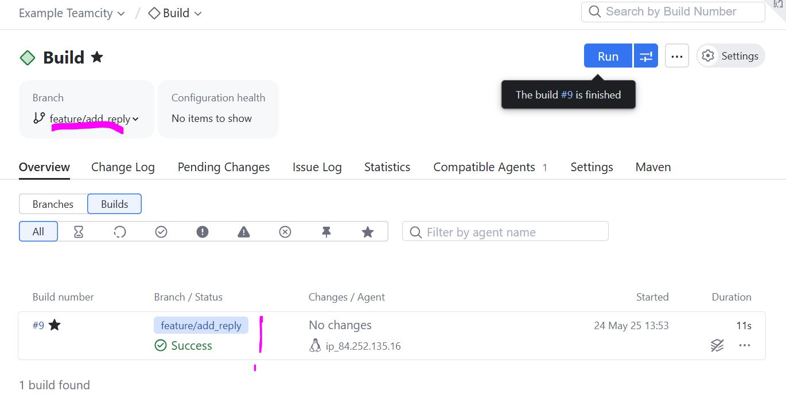

# Домашнее задание к занятию 11 «Teamcity»

1. Создайте новый проект в teamcity на основе fork.
  
2. Сделайте autodetect конфигурации.

3. Сохраните необходимые шаги, запустите первую сборку master.

4. Поменяйте условия сборки: если сборка по ветке master, то должен происходит mvn clean deploy, иначе mvn clean test.
Для deploy будет необходимо загрузить settings.xml в набор конфигураций maven у teamcity, предварительно записав туда креды для подключения к nexus.

5. В pom.xml необходимо поменять ссылки на репозиторий и nexus.

6. Запустите сборку по master, убедитесь, что всё прошло успешно и артефакт появился в nexus.

   
7. Мигрируйте build configuration в репозиторий.

8. Создайте отдельную ветку feature/add_reply в репозитории.

9. Напишите новый метод для класса Welcomer: метод должен возвращать произвольную реплику, содержащую слово hunter.
Дополните тест для нового метода на поиск слова hunter в новой реплике.

10. Сделайте push всех изменений в новую ветку репозитория.
Убедитесь, что сборка самостоятельно запустилась, тесты прошли успешно.

Внесите изменения из произвольной ветки feature/add_reply в master через Merge.
Убедитесь, что нет собранного артефакта в сборке по ветке master.
Настройте конфигурацию так, чтобы она собирала .jar в артефакты сборки.
Проведите повторную сборку мастера, убедитесь, что сбора прошла успешно и артефакты собраны.
Проверьте, что конфигурация в репозитории содержит все настройки конфигурации из teamcity.
В ответе пришлите ссылку на репозиторий.

https://github.com/AnyaAndreenko/example-teamcity
