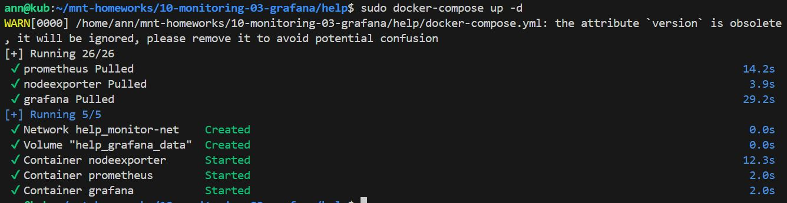
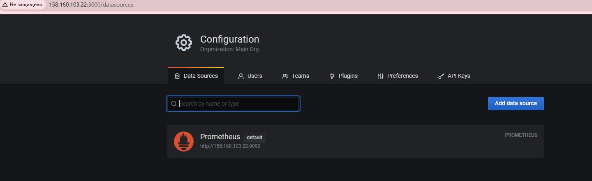

# Домашнее задание к занятию "13.Системы мониторинга"

Ответы на вопросы:

__1. Вас пригласили настроить мониторинг на проект. На онбординге вам рассказали, что проект представляет из себя платформу для вычислений с выдачей текстовых отчетов, которые сохраняются на диск. Взаимодействие с платформой осуществляется по протоколу http. Также вам отметили, что вычисления загружают ЦПУ. Какой минимальный набор метрик вы выведите в мониторинг и почему?__

CPU: загрузка процессора, так как вычисления нагружают CPU

RAM: использование оперативной памяти для отслеживания утечек памяти

Disk: свободное место и количество inodes (важно для сохранения отчетов)

Network: входящий/исходящий трафик (HTTP-взаимодействие)

HTTP: время ответа, количество запросов, коды ответов

Process: количество запущенных процессов, их состояние

__2. Менеджер продукта посмотрев на ваши метрики сказал, что ему непонятно что такое RAM/inodes/CPUla. Также он сказал, что хочет понимать, насколько мы выполняем свои обязанности перед клиентами и какое качество обслуживания. Что вы можете ему предложить?__

SLA метрики: процент успешных запросов (2xx), время ответа

Доступность: uptime/downtime

Производительность: среднее время обработки запроса

Количество ошибок: 4xx/5xx коды

Пользовательские метрики: количество активных пользователей, успешных операций

__3. Вашей DevOps команде в этом году не выделили финансирование на построение системы сбора логов. Разработчики в свою очередь хотят видеть все ошибки, которые выдают их приложения. Какое решение вы можете предпринять в этой ситуации, чтобы разработчики получали ошибки приложения?__

Лог-ротация: настроить ротацию и архивацию логов

Локальный сбор: разработчики собирают логи на своих машинах

Simple Log Server: поднять простой сервер для сбора ошибок

Email Alerts: автоматическое оповещение по критическим ошибкам

Webhook: интеграция с существующими системами уведомлений

__4. Вы, как опытный SRE, сделали мониторинг, куда вывели отображения выполнения SLA=99% по http кодам ответов. Вычисляете этот параметр по следующей формуле: summ_2xx_requests/summ_all_requests. Данный параметр не поднимается выше 70%, но при этом в вашей системе нет кодов ответа 5xx и 4xx. Где у вас ошибка?__

Проблема в формуле: нужно учитывать все успешные запросы (2xx) из всех обработанных запросов (не только 2xx/4xx/5xx).
Возможно, учитываются служебные запросы или запросы от ботов.
Может быть проблема с подсчетом всех запросов.

__5. Опишите основные плюсы и минусы pull и push систем мониторинга.__

__6. Какие из ниже перечисленных систем относятся к push модели, а какие к pull? А может есть гибридные?__

Prometheus, TICK, Zabbix, VictoriaMetrics, Nagios

__Классификация систем:__

__Pull:__ Prometheus, VictoriaMetrics

__Push:__ Zabbix, Nagios

__Гибридная:__ TICK (может работать в обоих режимах)

__P/S:__ VictoriaMetrics может работать как в pull, так и в push режиме, что делает её гибким решением для различных сценариев мониторинга.

__Pull модель (Prometheus, VictoriaMetrics):__

__Плюсы:__
Меньше нагрузки на агенты; Простая архитектура; Нет проблем с потерей данных; Легкое масштабирование!

__Минусы:__
Ограниченное количество метрик; Задержки при сборе; Сложность в настройке!

__Push модель (Zabbix, Nagios):__

__Плюсы:__
Быстрая доставка данных; Гибкая настройка; Широкий набор метрик!

__Минусы:__
Высокая нагрузка на агенты; Сложность масштабирования; Возможные потери данных!

7. Склонируйте себе репозиторий и запустите TICK-стэк, используя технологии docker и docker-compose.
В виде решения на это упражнение приведите скриншот веб-интерфейса ПО chronograf (http://localhost:8888).

P.S.: если при запуске некоторые контейнеры будут падать с ошибкой - проставьте им режим Z, например ./data:/var/lib:Z

8. Перейдите в веб-интерфейс Chronograf (http://localhost:8888) и откройте вкладку Data explorer.

Нажмите на кнопку Add a query
Изучите вывод интерфейса и выберите БД telegraf.autogen
В measurments выберите cpu->host->telegraf-getting-started, а в fields выберите usage_system. Внизу появится график утилизации cpu.
Вверху вы можете увидеть запрос, аналогичный SQL-синтаксису. Поэкспериментируйте с запросом, попробуйте изменить группировку и интервал наблюдений.
Для выполнения задания приведите скриншот с отображением метрик утилизации cpu из веб-интерфейса.

