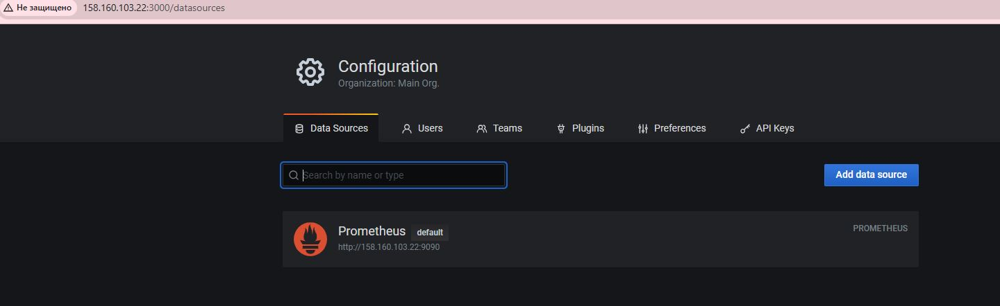
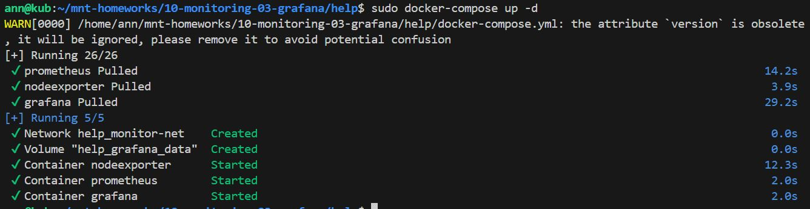
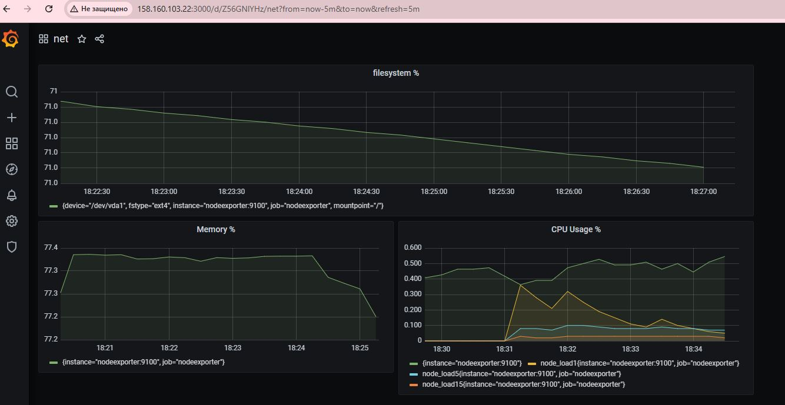
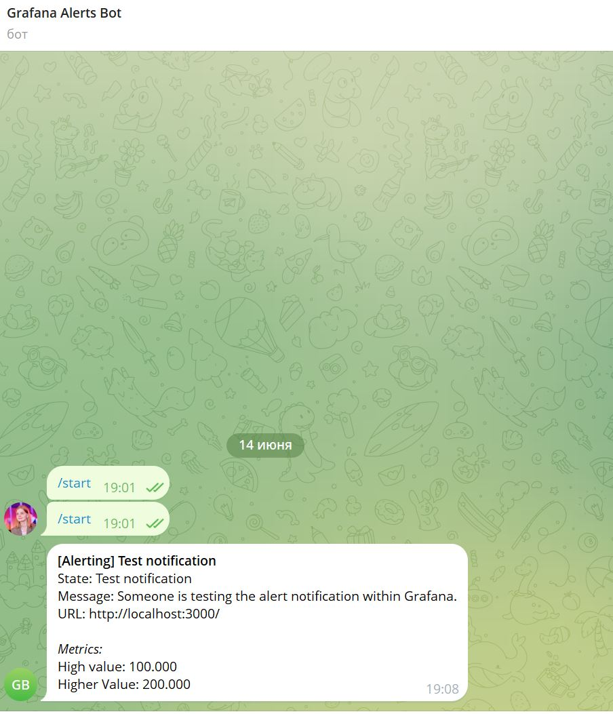

# Домашнее задание к занятию 14 «Средство визуализации Grafana»

## Задание 1

Используя директорию help внутри этого домашнего задания, запустите связку prometheus-grafana. Зайдите в веб-интерфейс grafana, используя авторизационные данные, указанные в манифесте docker-compose. Подключите поднятый вами prometheus, как источник данных.
Решение домашнего задания — скриншот веб-интерфейса grafana со списком подключенных Datasource.





## Задание 2

Создайте Dashboard и в ней создайте Panels:

1. утилизация CPU для nodeexporter (в процентах, 100-idle);

``` 
100 - (avg by(instance) (rate(node_cpu_seconds_total{mode="idle"}[1m])) * 100)
  ``` 
   
2. CPULA 1/5/15;
   
``` 
node_load1; node_load5 ; node_load15
 ``` 

4. количество свободной оперативной памяти;

```
node_memory_MemAvailable_bytes / node_memory_MemTotal_bytes * 100
``` 

5. количество места на файловой системе.

```
(node_filesystem_avail_bytes{mountpoint="/"} / node_filesystem_size_bytes{mountpoint="/"}) * 100
``` 

Для решения этого задания приведите promql-запросы для выдачи этих метрик, а также скриншот получившейся Dashboard.



## Задание 3

Создайте для каждой Dashboard подходящее правило alert — можно обратиться к первой лекции в блоке «Мониторинг».
В качестве решения задания приведите скриншот вашей итоговой Dashboard.



