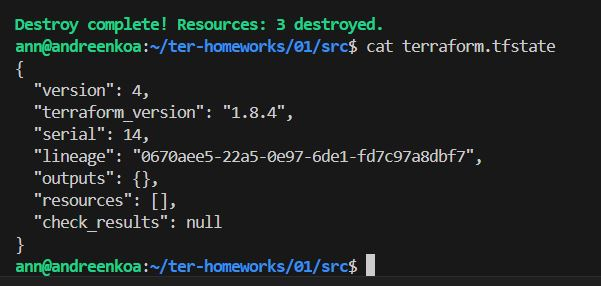

# Домашнее задание к занятию «Введение в Terraform»

###
Задание 1
Приложила скриншот вывода команды terraform --version + ответ комманды terrafotm init

### Изучите файл .gitignore. В каком terraform-файле, согласно этому .gitignore, допустимо сохранить личную, секретную информацию?

Директории .terraform/ и файлы *.tfstate

### Выполните код проекта. Найдите  в state-файле секретное содержимое созданного ресурса random_password, пришлите в качестве ответа конкретный ключ и его значение.

"result": "jvnAI34tbPpI3Let"

### Раскомментируйте блок кода, примерно расположенный на строчках 29–42 файла main.tf. Выполните команду terraform validate. Объясните, в чём заключаются намеренно допущенные ошибки. Исправьте их.

На строке 24 отсутствует имя и имя ресурса docker_container начинается с цифры - 1nginx
Ресурс docker_image.nginx не был объявлен в конфигурации, ошибка из-за того что добавилось имя, но в image не зафиксировалось это.

изменила кусок кода

### Выполните код. В качестве ответа приложите: исправленный фрагмент кода и вывод команды docker ps

### Замените имя docker-контейнера в блоке кода на hello_world. Не перепутайте имя контейнера и имя образа. Мы всё ещё продолжаем использовать name = "nginx:latest". Выполните команду terraform apply -auto-approve. Объясните своими словами, в чём может быть опасность применения ключа -auto-approve. Догадайтесь или нагуглите зачем может пригодиться данный ключ? В качестве ответа дополнительно приложите вывод команды docker ps.

Разница в том, что при выполнении команды с ключом -auto-approve будет запуск автоматический и может привести к незапланируемым и необратимым имзенениям. А без ключа будет запрашивать точно ли запускаем.

###  Уничтожьте созданные ресурсы с помощью terraform. Убедитесь, что все ресурсы удалены. Приложите содержимое файла terraform.tfstate.

###  Объясните, почему при этом не был удалён docker-образ nginx:latest.

Нужно заменить keep_locally = true на keep_locally = false

