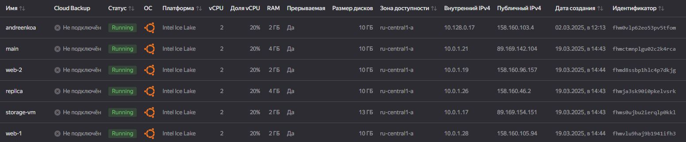

# Домашнее задание к занятию «Управляющие конструкции в коде Terraform»

### Задание 2

Нужно создать файл count-vm.tf. Описать в нём создание двух одинаковых ВМ  __web-1 и web-2__ (не web-0 и web-1) с минимальными параметрами, используя мета-аргумент count loop. 
Назначить ВМ созданную в первом задании группу безопасности.(как это сделать узнайте в документации провайдера yandex/compute_instance)
создать файл for_each-vm.tf. Описать в нём создание двух ВМ для баз данных с именами "main" и "replica" разных по cpu/ram/disk_volume, используя мета-аргумент for_each loop.

[count-vm.tf](https://github.com/AnyaAndreenko/ter-homeworks/blob/main/03/src/count-vm.tf)

[for_each-vm.tf](https://github.com/AnyaAndreenko/ter-homeworks/blob/main/03/src/for_each-vm.tf)

### Задание 3

Создайте 3 одинаковых виртуальных диска размером 1 Гб с помощью ресурса yandex_compute_disk и мета-аргумента count в файле disk_vm.tf .
Создайте в том же файле одиночную(использовать count или for_each запрещено из-за задания №4) ВМ c именем "storage" . Используйте блок dynamic secondary_disk{..} и мета-аргумент for_each для подключения созданных вами дополнительных дисков.

[disk_vm.tf](https://github.com/AnyaAndreenko/ter-homeworks/blob/main/03/src/disk_vm.tf)

### Задание 4

В файле ansible.tf создайте inventory-файл для ansible. Используйте функцию tepmplatefile и файл-шаблон для создания ansible inventory-файла из лекции. Готовый код возьмите из демонстрации к лекции demonstration2. Передайте в него в качестве переменных группы виртуальных машин из задания 2.1, 2.2 и 3.2, т. е. 5 ВМ.
Инвентарь должен содержать 3 группы и быть динамическим, т. е. обработать как группу из 2-х ВМ, так и 999 ВМ.

[hosts.cfg](https://github.com/AnyaAndreenko/ter-homeworks/blob/main/03/src/hosts.cfg)

