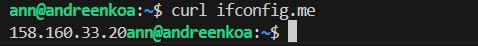

# Домашнее задание к занятию «Основы Terraform. Yandex Cloud»

### Задание 1
Приложила скриншот ЛК Yandex Cloud с созданной ВМ, где видно внешний ip-адрес;

Приложила скриншот консоли, curl должен отобразить тот же внешний ip-адрес;

### Задание 2

### Задание 3

### Задание 4
