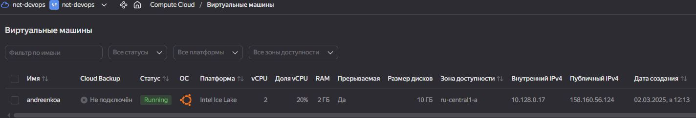

# Домашнее задание к занятию «Основы Terraform. Yandex Cloud»

### Задание 1
Приложила скриншот ЛК Yandex Cloud с созданной ВМ, где видно внешний ip-адрес;

Приложила скриншот консоли, curl должен отобразить тот же внешний ip-адрес;

Ответы
__preemptible = true (Прерываемые вм) __
Особенность данных вм отключаться через 24 часа не использования. Подходят для на короткое время для проверки и тестирования навыков обучения.

__core_fraction=5 (ограничитель процента мощности процессора!)__
5 -10 % хватает для выполнения ДЗ

### Задание 2

Нужно объявить переменные в файле variables.tf и Заменить все хардкод-значения для ресурсов yandex_compute_image и yandex_compute_instance на отдельные переменные. К названиям переменных ВМ добавить в начало префикс vm_web_ .  
Пример: vm_web_name.

[variables.tf](https://github.com/AnyaAndreenko/ter-homeworks/blob/main/02/src/variables.tf)

### Задание 3

### Задание 4
