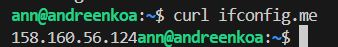
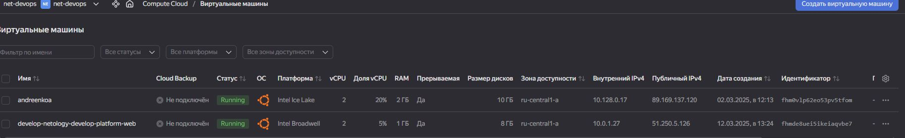

# Домашнее задание к занятию «Основы Terraform. Yandex Cloud»

### Задание 1
Приложила скриншот ЛК Yandex Cloud с созданной ВМ, где видно внешний ip-адрес;

Приложила скриншот консоли, curl должен отобразить тот же внешний ip-адрес;

Ответы
__preemptible = true (Прерываемые вм) __
Особенность данных вм отключаться через 24 часа не использования. Подходят для на короткое время для проверки и тестирования навыков обучения.

__core_fraction=5 (ограничитель процента мощности процессора!)__
5 -10 % хватает для выполнения ДЗ

### Задание 2

Нужно объявить переменные в файле variables.tf и Заменить все хардкод-значения для ресурсов yandex_compute_image и yandex_compute_instance на отдельные переменные. К названиям переменных ВМ добавить в начало префикс vm_web_ .  
Пример: vm_web_name.

[variables.tf](https://github.com/AnyaAndreenko/ter-homeworks/blob/main/02/src/variables.tf)

### Задание 3

Создайте в корне проекта файл 'vms_platform.tf' . Перенесите в него все переменные первой ВМ.
Скопируйте блок ресурса и создайте с его помощью вторую ВМ в файле main.tf: "netology-develop-platform-db" ,  cores  = 2, memory = 2, core_fraction = 20. Объявите её переменные с префиксом vm_db_ в том же файле ('vms_platform.tf').  ВМ должна работать в зоне "ru-central1-b"
Примените изменения.

Пыталась убрать кусок кода с 76 по 86 строку в отдельный файл, ничего не получилось +в следующем задании вообще какая-то не понятная ошибка

[vms_platform.tf](https://github.com/AnyaAndreenko/ter-homeworks/blob/main/02/src/vms_platform.tf)

### Задание 4
Объявите в файле outputs.tf один output , содержащий: instance_name, external_ip, fqdn для каждой из ВМ в удобном лично для вас формате.(без хардкода!!!)
Примените изменения.

В качестве решения приложите вывод значений ip-адресов команды terraform output.

Все вроде складывается а эту ошибку никак не могу исправить

